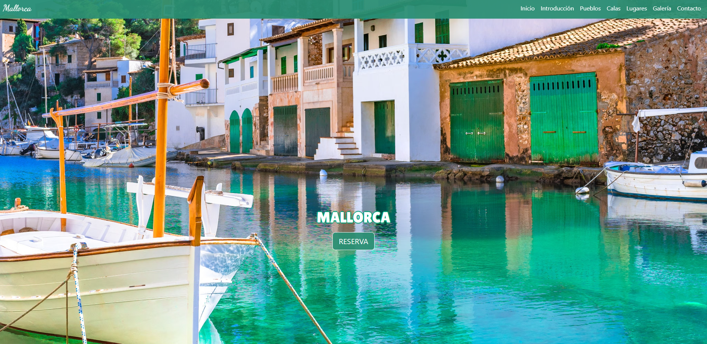
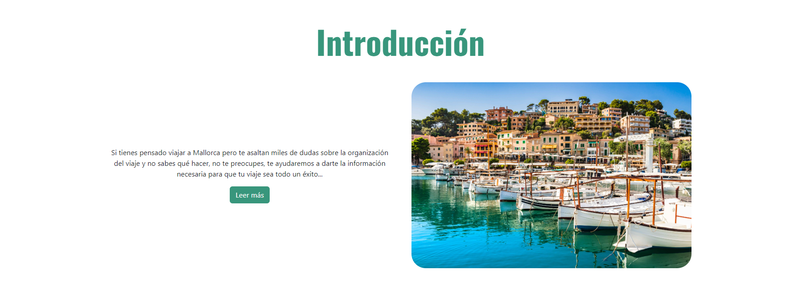
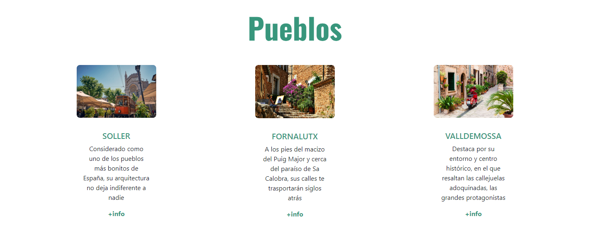
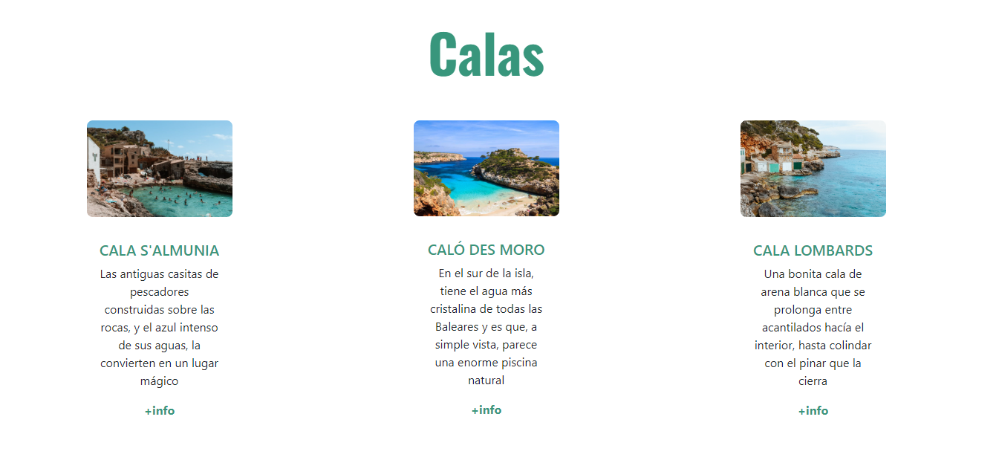
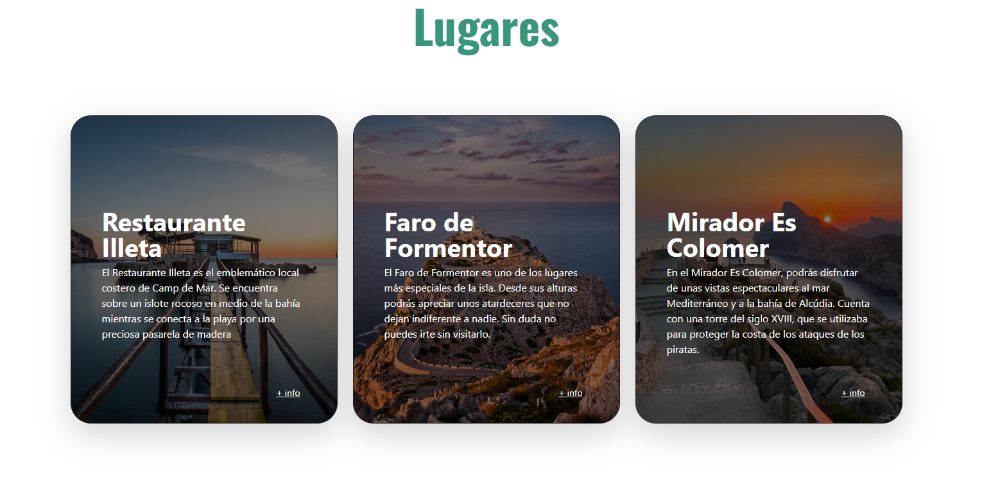
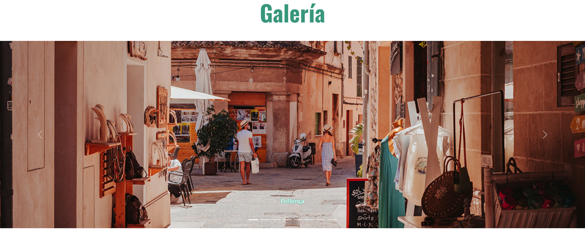
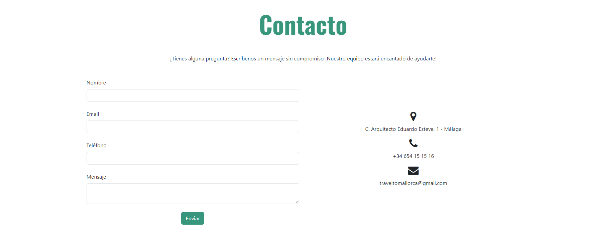
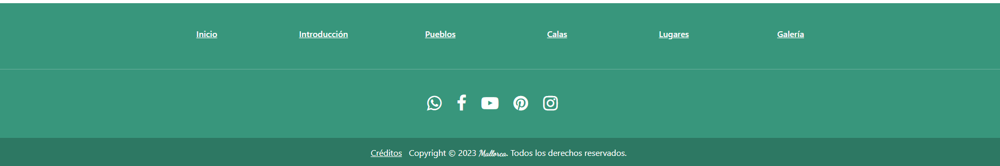

<h1>Memoria de Mallorca con Bootstrap</h1>
 

<h2>Indice</h2>
<ul>
  <li><a href="#introduccion">Introducción</a></li>
  <li><a href="#motivacion">Motivación</a></li>
  <li><a href="#estructura">Estructura</a></li>
  <li><a href="#estilo">Estilo</a></li>
  <li><a href="#codesnippets">Code Snippets</a></li>
</ul>

<h2 id="introduccion">Introducción</h2>

Trabajo realizado por Alba Romero

Proyecto de web realizado con bootstrap y basado en el modelo de trabajo del primer trimestre"

Trabajo realizado con fines educativos

Febrero de 2024

CopyRight ©

<h2 id="motivacion">Motivación</h2>

El tema lo he elegido ya que me encanta viajar a diferentes partes del mundo, pero en concreto, cuando visité Mallorca, quede totalmente enamorada. La idea es que esta página sirva para que otras personas puedan visitar los que, desde mi punto de vista, son los lugares imprescindibles de la isla.

<h2 id="estructura">Estructura</h2>

La web está dividida en 8 secciones:

<ul>
  <li>Hero Section</li>  
  <li>Introducción</li>
  <li>Pueblos</li>
  <li>Calas</li>
  <li>Lugares</li>
  <li>Galería</li>
  <li>Contacto</li>
  <li>Footer</li>
</ul>

<h3>Hero Section</h3>

Para esta sección he usado una imagen de fondo tomada de Civitatis, es responsive en todo los tamaños de dispositivos diferentes. Por otro lado, he incluido en su interior un rótulo de texto con el título de mi página y un botón de Call to Action para que las personas puedan pulsar y directamente les lleve a una nueva pestaña donde podrán reservar su próximo viaje.

<h3>Introducción</h3>

Para esta sección he usado un grid de dos columnas, una para el texto y otra para la imagén. Un Diseño que considero simple pero estético. Por otro lado, he hecho uso de un botón de "Universe.io" que nos permitirá ir a otra subpágina para poder leer toda la información, en caso de que nos interese. De esta forma, puedo asegurar que la página principal no quede sobrecargada de texto y vaya acorde con la imagen.

<h3>Pueblos</h3>

Para esta sección, he usado un grid de tres columnas, incluyendo en todas ellas una card tomada del proyecto modelo de clase pero poniendola totalmente adoptada a mi gusto y el estilo de mi página. Tanto esta sección como las dos siguientes juegan con las responsividad que bootstrap proporcina, dependiendo del tamaño del dispositivo desde el que se esté viendo la web, podremos ver la estructura en una, dos o tres columnas.Cada card tiene un botón que directamente nos lleva a otra página con diversa información sobre cada uno de los pueblos.

<h3>Calas</h3>

Esta seccción es totalmente igual que la anterior. En ella también disponemos de un botón por cada card que nos lleva directos a una web externa con información.

<h3>Lugares</h3>

En este caso, también utilizo un grid de tres columnas pero con unas cards con un diseño distinto, también sacadas de "xxxxxxxxxxxxxxxx". Al igual que el las dos secciones anteriores, son totalmentes responsives y tienen un efecto que queda muy estético.

<h3>Galería</h3>

Para la galería, he obtenido un code snippet de la famosa página "GetBootstrap". Un slider simple pero dinámico y estético. Consta de 8 fotos diferentes de varios lugares de la isla y con su pie de página para que la persona pueda saber que lugar esta visualizando.

<h3>Contacto</h3>

Para el contacto, he usado un code snippet de "MDBootstrap". Este fragmento de código cuenta con una sección para un formulario de entrada de datos en el que se pide el nombre, email, número de teléfono y el mensaje de texto que se quiere enviar. La otra sección cuenta con un pequeño apartado de información de contacto, donde podemos ver el teléfono, mail y dirección de la empresa. Es un apartado de contacto muy sencillo pero a la vez visual y estético.

<h3>Footer</h3>

En esta última sección he usado un code snippet de "MDBootstrap". Este fragmento de código cuenta con 

<h2 id="snippets">Code snippets</h2>

He utilizado los siguientes:

<ul>
  <li>Barra de navegación: Tomada de GetBootstrap (https://getbootstrap.com/docs/5.0/components/navbar/)</li>
  <li>Slider de galería: Tomada de GetBootstrap (https://getbootstrap.com/docs/5.0/components/carousel/)</li> 
  <li>Cards:</li>
  <li>Form: Tomado de MDBootstrap (https://mdbootstrap.com/docs/b4/jquery/forms/contact/)</li>
  <li>Footer: Tomado de MDBootstrap (https://mdbootstrap.com/snippets/standard/mdbootstrap/2885047?view=side)</li>
  <li>Modal: Tomado de GetBootstrap (https://getbootstrap.com/docs/4.0/components/modal/)</li>
</ul>]
